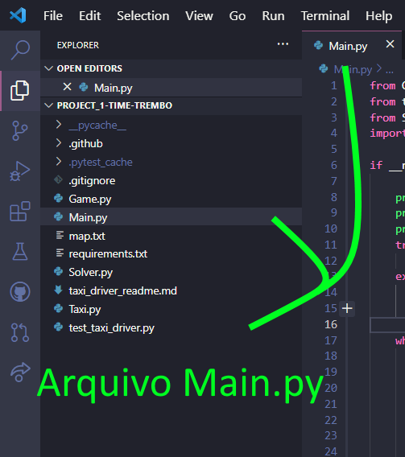
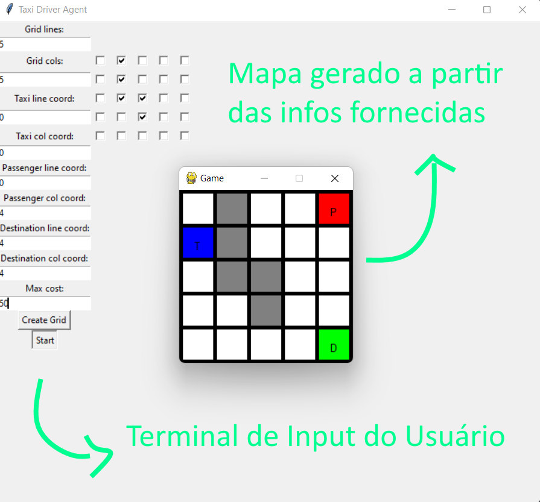
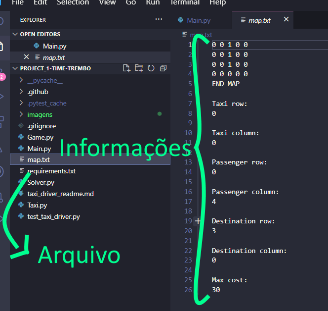
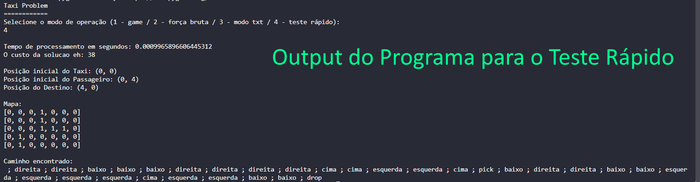

# project_1-time-trembo
project_1-time-trembo de Inteligência Artificial e Robótica

## Autores:
- [Eduardo Mendes Vaz](https://github.com/EduardoMVAz)
- [João Lucas de Moraes Barros Cadorniga](https://github.com/JoaoLucasMBC)
- [Thomas Chiari Ciocchetti de Souza](https://github.com/thomaschiari)

## Descrição:
Um agente autônomo que consegue elaborar a rota ótima para um taxi chegar a um passageiro, evitando obstáculos, e deixá-lo em seu destino de maneira ótima.


## Questões:  
### O que é relevante representar nos estados do mundo? Como os estados são estruturados (estrutura de dados) e qual o significado dela (dos campos)?

- Os estados do sistema são representados por instâncias da classe `Taxi`, que depende de alguns fatores (campos) passados na criação de novos objetos para o funcionamento do sistema de procura:  
1. `op` - operador é uma String que representa a ação tomada pelo agente para alcançar tal estado. Pode ser "direita", "esquerda", "cima" e "baixo" para movimentação do Taxi no mapa ou "pick" e "drop" para ações de pegar ou deixar um passageiro.  
2. `pos_taxi` - Tupla da posição atual do taxi no mapa. A cada geração de novo sucessor, é criada uma cópia da dessa tupla, que, atualizada, é passada para os filhos.  
3. `pos_passenger` - Tupla da posição atual do passageiro no mapa. Assim como o taxi, o passageiro se move pelo mapa, mas apenas se o táxi estiver esse cheio (o que é representado pelo atributo `is_full`). Caso esse seja o caso, a posição do passageiro sempre será uma cópia da posição atualizada do táxi.  
4. `pos_destination` - Tupla da posição do destino final. Como o destino é fixo, ela nunca é alterada durante a execução do programa, apenas passada para os filhos, que a utilizam para calcular se o estado atual é meta (comparando com a posição atual do passageiro).
5. `map` - Matriz $NxN$ definida na instanciação do primeiro estado que representa a disposição dos obstáculos no mapa. Elementos `1` representam obstáculos, e qualquer outro elemento é considerado um espaço ocupável pelo táxi no mapa. Também é estático, ou seja, não é alterado e é apenas usado para checagem das movimentações na geração de sucessores. É sempre passado para o próximo filho.  
6. `is_full` - Booleano que determina se o taxi está carregando ou não o passageiro. Caso seja verdadeira, a posição atual do passageiro sempre será uma cópia da posição do táxi. Além disso, quando verdadeira indica que o estado não pode ser meta, já que o passageiro não pode estar no táxi. Além disso, controla a poda de criação de sucessores, já que não é possível pegar um passageiro com táxi cheio e vice-versa.

Com essas características para descreverem os estados do mundo, é possível realizar uma busca para encontrar o caminho ideal do táxi para realizar a tarefa.


### Mostre como ficam representados os estados inicial e final segundo a representação adotada.

- O estado inicial é uma instanciação do objeto `Taxi` na qual o `op` é vazio. Um exemplo possível para o mapa:

```
mapa_1 = [[0, 0, 0, 1, 0, 0, 0],
          [0, 0, 0, 1, 0, 0, 0],
          [0, 0, 0, 1, 0, 0, 0],
          [0, 0, 0, 0, 0, 0, 0],
          [0, 0, 0, 0, 0, 0, 0]]
```

Podemos criar o estado inicial:

```
Taxi('', pos_taxi=(0, 0), pos_passenger=(0, 5), pos_destination=(4, 0), map=mapa_1, is_full=False)
```

- Agora, a partir dele, serão gerados os sucessores possíveis, como:

```
Taxi('direita', pos_taxi=(0, 1), pos_passenger=(0, 5), pos_destination=(4, 0), map=mapa_1, is_full=False)
```

- Ao fim dessa execução, o estado final encontrado será:

```
Taxi('drop', pos_taxi=(4, 0), pos_passenger=(4, 0), pos_destination=(4, 0), map=mapa_1, is_full=False)
```

- Isso acontece pois chegamos no estado esperado (posição do passageiro igual a de destino) e o táxi está vazio, portanto, sua última ação é `drop`. O caminho gerado pelo agente (com custo **30**) é:

`" ; direita ; direita ; baixo ; baixo ; baixo ; direita ; direita ; direita ; cima ; cima ; cima ; pick ; esquerda ; baixo ; baixo ; baixo ; esquerda ; esquerda ; esquerda ; esquerda ; baixo ; drop"`


### Quais as operações sobre os estados? (detalhe como cada operação irá alterar os estados e quais as condições para cada operação ser executada)

- Existem 6 ações possíveis que podem ser realizadas pelo agente `Taxi`, 4 delas o movimentando pelo ambiente e 2 de pegar ou deixar um passageiro em uma certa posição. Cada uma delas afeta o próximo estado de maneira diferente e possui condições próprias para que o sucessor seja gerado:

1. `"direita"` - movimentação do táxi um quadrado para a direita.
    * **Condição**: quadrado à direita não é obstáculo no mapa (representado por 1 na matriz) e agente não se encontra na borda direita (ou seja, sua coluna +1 é menor que o tamanho das linhas)  
    * **Impacto**: além de passar o operador indicado, a posição do táxi será atualizada em +1 no número da coluna. Caso o táxi esteja cheio (`is_full`), a posição do passageiro também será atualizada para a nova localização do táxi na matriz do mapa.

1. `"esquerda"` - movimentação do táxi um quadrado para a esquerda.
    * **Condição**: quadrado à esquerda não é obstáculo no mapa (representado por 1 na matriz) e agente não se encontra na borda esquerda (ou seja, sua coluna -1 é maior ou igual a 0)  
    * **Impacto**: além de passar o operador indicado, a posição do táxi será atualizada em -1 no número da coluna. Caso o táxi esteja cheio (`is_full`), a posição do passageiro também será atualizada para a nova localização do táxi na matriz do mapa.

1. `"cima"` - movimentação do táxi um quadrado para cima.
    * **Condição**: quadrado acima não é obstáculo no mapa (representado por 1 na matriz) e agente não se encontra na borda superior (ou seja, sua linha -1 é maior ou igual a 0)  
    * **Impacto**: além de passar o operador indicado, a posição do táxi será atualizada em -1 no número da linha. Caso o táxi esteja cheio (`is_full`), a posição do passageiro também será atualizada para a nova localização do táxi na matriz do mapa.

1. `"baixo"` - movimentação do táxi um quadrado para baixo.
    * **Condição**: quadrado abaixo não é obstáculo no mapa (representado por 1 na matriz) e agente não se encontra na borda inferior (ou seja, sua linha +1 é menor que o número de linhas)  
    * **Impacto**: além de passar o operador indicado, a posição do táxi será atualizada em +1 no número da linha. Caso o táxi esteja cheio (`is_full`), a posição do passageiro também será atualizada para a nova localização do táxi na matriz do mapa.

1. `"pick"` - passageiro é pego pelo táxi.
    * **Condição**: posição do táxi é a mesma que a do passageiro e o táxi não está ocupado (`is_full`)  
    * **Impacto**: além de passar o operador indicado, a variável `is_full` do estado será atualizada para `True`

1. `"drop"` - passageiro é deixado pelo táxi.
    * **Condição**: posição do táxi é a mesma que a de destino e o táxi está ocupado (`is_full`)  
    * **Impacto**: além de passar o operador indicado, a variável `is_full` do estado será atualizada para `False`


*Vale destacar que as ações pick e drop possuem custo de 5, enquanto todas as movimentações custam 1. Isso é gerado pelo método `cost`, que analiza o operador do estado.*


### Que algoritmo de busca foi utilizado para resolver este problema considerando que a solução apresentada precisa ser ótima e que deve ser processada na ordem de segundos, no máximo em poucos minutos?

- Considerando que temos um problema em que o custo das ações não é sempre o mesmo, precisamos encontrar o caminho com menor custo e precisamos fazer isso de maneira eficiente, ordenando os estados que "possuem mais potencial" de estarem próximos do estado meta, o algoritmo utilizado foi o **AEstrela**.

- Ele foi escolhido pois analisa não apenas o custo de cada estado, mas a heurística (previsão de custo até a meta) e ordena os sucessores que serão analizados pela soma desses dois fatores, aumentando muito a *eficiência* do algoritmo de busca. 

- Além disso, possui poda que impede a criação de estados na árvore que já foram passados anteriormente, melhorando ainda mais a sua eficiência e tempo de execução.


### A equipe fez uso de heurísticas? Se sim, explique as heurísticas utilizadas.

- Com a escolha do algoritmo A*, o uso de uma heurística se tornou essencial. Como o objetivo é estimar um custo até o estado meta, fizemos uso da **distância manhattan**, ou seja, a soma das distâncias horizontais e verticais entre dois pontos para calcular a heurística. Além disso, como tratamos de um mundo representado por uma grade, ou seja, apenas com movimentos verticias ou horizontais, essa heurística se mostra ainda melhor.

- No entanto, vale ressaltar que a heurística tem uma peculiaridade: ela é calculada de maneira diferente dependendo do estado atual do agente:

    1. Caso ele esteja **VAZIO** (`is_full = False`), a heurística será a distância Manhattan do táxi até o passageiro, já que essa deve ser a primeira etapa realizada pelo agente: buscar o passageiro.  
    2. Caso ele esteja **CHEIO** (`is_full = True`), a heurística será a distância Manhattan do passageiro até o destino, já que essa deve ser a segunda etapa realizada pelo agente: deixar o passageiro no seu destino.


### Quais são os limites da solução? A solução consegue tratar mapas com que dimensões? Quão complexo pode ser a estrutura de obstáculos?

- Para testar os limites da solução, desenvolvemos um algoritmo para rodar o agente várias vezes com mapas que aumentassem. A situação escolhida foi testar somente mapas quadrados, sem obstáculos, com o taxista começando em uma ponta do mapa, o objetivo na ponta oposta, e o passageiro em uma ponta intermediária, como no exemplo:

          Taxista - 0 - 0 - 0 - 0
          
                0 - 0 - 0 - 0 - 0
                
                0 - 0 - 0 - 0 - 0
                
       Passageiro - 0 - 0 - 0 - Objetivo
      
- Testando com mapas incrementando de 10 em 10, obtivemos a seguinte tabela de tempos, até o mapa 300x300, sendo que a partir de um mapa 290x290 o agente foi incapaz de encontrar a solução num tempo menor que 5 minutos, definido por nós como um tempo excedendo o aceitável:

| Tamanho do Mapa (Quadrado) | Tempo para Encontrar Solução |
| --- | --- |
| 10 | 0:00:00.002994 |
| 20 | 0:00:00.015024 |
| 30 | 0:00:00.051862 |
| 40 | 0:00:00.131684 |
| 50 | 0:00:00.271310 |
| 60 | 0:00:00.530578 |
| 70 | 0:00:00.967419 |
| 80 | 0:00:01.635714 |
| 90 | 0:00:02.650357 |
| 100 | 0:00:03.810827 |
| 110 | 0:00:05.327272 |
| 120 | 0:00:07.486217 |
| 130 | 0:00:10.331807 |
| 140 | 0:00:13.852794 |
| 150 | 0:00:17.897012 |
| 160 | 0:00:23.499133 |
| 170 | 0:00:29.591780 |
| 180 | 0:00:36.708761 |
| 190 | 0:00:43.924284 |
| 200 | 0:00:56.546237 |
| 210 | 0:01:09.234622 | 
| 220 | 0:01:21.149291 |
| 230 | 0:01:38.069432 |
| 240 | 0:01:58.591772 |
| 250 | 0:02:22.400690 |
| 260 | 0:02:51.047654 |
| 270 | 0:03:34.364829 |
| 280 | 0:04:27.563929 |
| 290 | 0:05:25.297154 |
| 300 | 0:05:40.037669 |

- Portanto, definimos a marca 300 como o limite de resolução do agente, de forma eficiente. 

- Sobre os obstáculos, não há complexidade na sua implementação; Se os obstáculos impossibiltam o acesso ao passageiro ou ao destino, a solução é inexistente. Do contrário, os obstáculos podem dificultar a resolução, porém não impedí-la.

-------

### Instalação & Como Utilizar

Para utilizar o **agente Taxi Driver**, você deve ter Python na versão 3.10 instalado no seu computador e seguir os passos:

1. Clone o repositório na sua máquina na pasta de sua escolha. Utilize o comando:

`git clone https://github.com/insper-classroom/project_1-time-trembo.git`

2. Instale o pacote Tkinter, que é necessário para a interface gráfica do programa. Caso esteja utilizando Windows, o pacote já faz parte da instalação padrão do Python. Caso esteja utilizando Linux, utilize o comando abaixo:

`sudo apt-get install python3.10-tk`

4. Utilizando o terminal / a IDE de sua escolha, crie uma *Virtual Env* (altamente recomendado) de Python e a ative:

`python -m venv env` (Windows)

`env/Scripts/Activate.ps1` (Windows)

`python3.10 -m venv env` (Linux)

`source env/bin/activate` (Linux)

3. Mude para a pasta do programa e instale as bibliotecas requeridas:

`cd ./project_1-time-trembo`

`pip install -r requirements.txt`

4. Para utilizar o programa, um arquivo `Main.py` foi desenvolvido, de onde o usuário pode testar todas as funcionalidades da aplicação interagindo com o **terminal**. Ao rodar o arquivo, o usuário deve inserir qual funcionalidade ele deseja testar e então ali receberá os *resultados* obtigos pelo agente.

Para rodar o programa, utilize comando abaixo no diretório raiz do projeto, com o ambiente virtual ativado:

          python Main.py



### Funcionalidades Disponíveis:

#### 1. Jogo  
A primeira funcionalidade é a implementação da interface gráfica, onde o usuário primeiro seleciona as posições do taxista, do passageiro e do objetivo, além do tamanho da grade que será percorrida pelo agente, e, então, o usuário pode montar com cliques os obstáculos no mapa. A partir das informações fornecidas, o programa abre em uma janela pygame o mapa e o caminho encontrado pelo agente será demonstrado. **Cada *clique* do mouse passa uma ação do agente**. 

Caso o usuário selecione posições não presentes no mapa, o programa avisa sobre o usuário sobre o respectivo erro. É importante notar que ao informar o tamanho do mapa, por exemplo, um de 5 linhas por 5 colunas, esses números representam as quantidades de linhas. No entanto, todas as posições seguem o formato de listas e iteráveis em Python, **começando em 0**. Portanto, nesse mapa, as linhas iriam de 0 a 4, assim como as colunas. Ao mesmo tempo que o jogo roda, todas as informações referentes a situação resolvida serão impressas no terminal.

Por fim, vale destacar que o programa permite múltiplas simulações do usuário. Após apresentar o caminho do agente, a janela pygame fecha, no entanto, a GUI de customização continua aberta e pode ser utilizada novamente para gerar outra grade e outra simulação para o agente.



#### 2. Força Bruta  
Além de poder utilizar a interface gráfica, o usuário também pode realizar um teste para o limite do agente na sua máquina, assim como descrito na questão anterior. Essa funcionalidade apresenta a situação mais simples para a inteligência artificial: um mapa sem obstáculos, com o objetivo e o taxista em pontas opostas, e o passageiro em uma das pontas intermediárias de um mapa quadrado. Porém, o mapa é incrementado, de 10 em 10 em suas duas dimensões, infinitamente. Dessa forma, o usuário pode visualizar o tempo que o agente leva para resolver essa situação, à medida que o tamanho do mapa aumenta, que é sempre impresso no terminal.

#### 3. Modo Texto (Custom)
A terceira funcionalidade envolve o preenchimento de um arquivo .txt, o `map.txt`, já disponibilizado no diretório raiz do projeto, no qual o usuário pode informar as características de uma situação específica que ele quer que o agente tente resolver. No arquivo devem ser informados o **mapa**, as posições do **taxi, passageiro e destino** e o **custo máximo da viagem**.

Uma observação importante sobre o preenchimento do arquivo `map.txt` é que as informações devem ser inseridas seguindo o padrão especificado no exemplo, pois, caso as elas sejam preenchidas de forma incorreta ou incoerente (texto no lugar de números, alterar as linhas que dizem o que deve ser inserido) o programa será incapaz de ler e de resolver a situação. Ao final da execução, todas as informações referentes ao resultado serão impressas no terminal.



#### 4. Teste Rápido  
Por fim, a última funcionalidade é a mais simples: o programa executa uma situação exemplo, previamente preparada, e, ao final da execução, todas as informações referentes a situação resolvida serão impressas no terminal. Essa funcionalidade serve como uma demonstração rápida do funcionamento da IA ao usuário.


